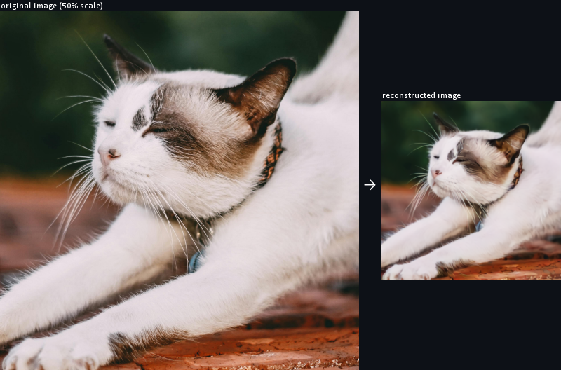

# TinySanaPreview
TinySanaPreview is a custom ComfyUI node that implements real-time previews during generation for Sana diffusion models.

## Setup
 1. Clone this respository into your `custom_nodes` directory  
    `git clone https://github.com/cake-ml/tiny-sana-preview.git ComfyUI/custom_nodes/tiny-sana-preview`
 2. Download the [`tsd.safetensors` decoder model](https://huggingface.co/cake-ml/tsd/resolve/main/tsd.safetensors?download=true) from Hugging Face and place it in your `models/vae_approx` directory
 3. Restart ComfyUI and insert the `latent > TinySanaPreview` node to your workflow anywhere before the sampling node, then select the `tsd.safetensors` decoder model and appropriate dtype (bf16 is recommended, but older GPUs may require fp16 or fp32)

## Decoder model
The TinySanaDecoder model can be found on Hugging Face at [cake-ml/tsd](https://huggingface.co/cake-ml/tsd). TSD decodes with a compression factor of 8, rather than the standard 32 of the Sana DC-AE, and utilises far fewer parameters (9.6M vs 159M). This results in preview images with a quarter of the width/height that the DC-AE decoder produces, but with a roughly 46x speedup (8.42ms vs 389ms for a `1, 32, 32, 32` latent on an Nvidia RTX A4000) and a significantly lower memory footprint. Latents of dimensions `B, 32, W, H` will decode to images of dimensions `B, 3, W*8, H*8`. The TSD model was trained on an Nvidia RTX A4000 for approximately 60 hours.

